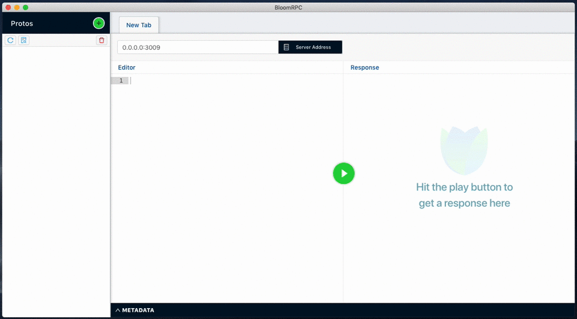

<p align="center">
  
</p>
<h1 align="center">BloomRPC</h1>

<p align="center">
  
  <a href="https://uw-labs.slack.com/">
    
  </a>
</p>
<p align="center">The missing GUI Client for GRPC services. 🌸 </p>

<p align="center">Inspired by <b>Postman</b> and <b>GraphQL Playground</b><br/>
  <b>BloomRPC</b> aims to provide the simplest and most efficient developer experience for exploring
and querying your GRPC services.
</p>

<br/>

<p align="center">
  Install the client, select your protobuf files and start making requests! <br/>
  No extra steps or configuration needed.
</p>

## Features

- Native GRPC calls
- Unary calls
- Server, client, and bidrectional streaming
- Input feedback
- Multi-tab operations
- Metadata support
- Workspace persistence
- Request cancellation
- Many more!

### Shortcuts

<kbd>Ctrl-w</kbd>/<kbd>Command-w</kbd>: Closes the tab.

<kbd>Esc</kbd>: Focuses on the editor.

<kbd>Ctrl-Enter</kbd>/<kbd>Command-Enter</kbd>: Ends the request.

### GRPC Web

GRPC Web is now supported! Just flip the toggle from `GRPC` to `WEB`.

Note on https:

- add https to the url, note for GRPC-Web it also supports path, e.g. https://example.com/grpcweb/v1
- or turn on "TLS" -> Server certificate (default port will change to 443)
- self-signed certificate not supported at the moment

## Installation
Windows, macOS, and Linux are supported.

To download the installer, go to the [Releases Page](https://github.com/uw-labs/bloomrpc/releases).

Alternatively, package managers can be used.
#### macOS/Homebrew
```
brew install --cask bloomrpc
```

#### Windows/Chocolatey
```
choco install bloomrpc
```

### To build from source:
```
git clone https://github.com/uw-labs/bloomrpc.git
cd bloomrpc

yarn install && ./node_modules/.bin/electron-rebuild
npm run package
```
The installer will be located in the `release` folder.

## Preview



## Contributing

`CONTRIBUTING.md` coming soon!

#### Development Mode

Run the two commands below in separate terminals:
```
npm run start-server-dev
npm run start-main-dev
```

## Acknowledgements
<p float="left">
  
  
  
</p>
